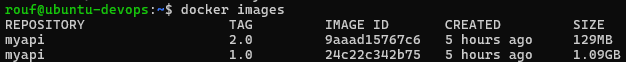

# Disini saya mempraktekkan sebuah mini project buatan saya dengan tema materi Security & Optimization Docker image 

## Skenario Proyek
Kita akan mengambil aplikasi Node.js API yang sudah familier, Tetapi kali ini kita akan fokus untuk membuatnya sekecil dan seaman mungkin. Kita akan melalui beberapa fase:

1. Baseline Membuat Dockerfile yang umum, yang berfungsi tapi tidak aman
2. Audit Memindai image ini menggunakan `Trivy` untuk menemukan celah keamanan
3. Hardening Menulis ulang Dockerfile dengan best pratices keamanan: non-root user, multi-stage build, dan minimal base image  
4. Verifikasi memindai ulang image yang sudah aman dan membandingkan hasilnya

Berikut command yang harus di jalankan

- Pertama pastikan sudah menggunakan command berikut 
```bash
npm install
```

- Buat Image untuk Docker yang biasanya digunakan dan kurang aman
```bash
docker build -t myapi:1.0 -f Dockerfile.v1 .
```
- Lalu langsung kita running docker menggunakan image trivy dari docker resmi supaya langsung scan image yang sudah kita tentukan.dan kita lihat hasilnya..
```bash
docker run --rm -v /var/run/docker.sock:/var/run/docker.sock \
aquasec/trivy:latest \
--timeout 10m \
image myapi:1.0
```


### Image versi 2.0 yang aman dan membandingkannya 

- Buat Image untuk Docker yang aman dan optimal (Command dibawah akan langsung mengeksekusi Dockerfile saja bukan Dockerfile.v1)
```bash
docker build -t myapi:2.0 .
```
- Lalu langsung kita running docker menggunakan image trivy dari docker resmi supaya langsung scan image yang sudah kita tentukan.dan kita lihat hasilnya..
```bash
docker run --rm -v /var/run/docker.sock:/var/run/docker.sock \
aquasec/trivy:latest \
--timeout 10m \
image myapi:2.0
```


## Berikut perbandingan ukuran kedua image dengan yang sudah di optimalkan dan belum


# Kesimpulan
Baris pada image untuk tag myapi:2.0 memberitahu kita bahwa untuk sistem operasi (alpine) di dalam container kita, Trivy menemukan 0 celah keamanan.
Jika kita memindai image myapi:1.0 yang menggunakan node:18 (berbasis Debian), bagian ini akan berisi daftar panjang celah keamanan level sistem operasi. Dengan beralih ke alpine, kita telah secara drastis mengurangi attack surface dari sisi sistem operasi, yang merupakan salah satu tujuan utama kita.

